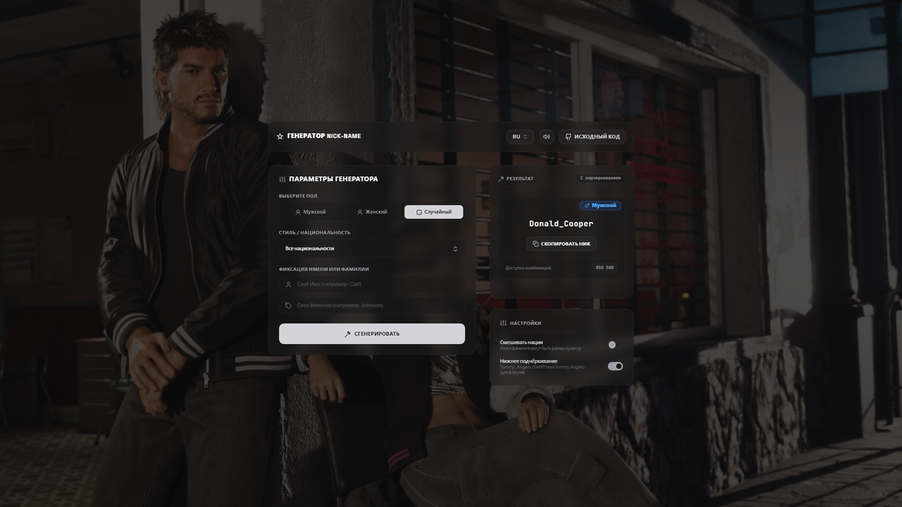

<p align="center"></p>

### Generator Nickname
Веб-сайт по генирации Nickname для личных целей.

## 🚀 Возможности

- 🎭 **Генерация RolePlay ников** (Мужские / Женские / Случайные)
- 🌍 **6 национальностей** (Американские, Итальянские, Русские, Японские, Испанские, Немецкие)
- 🔀 **Смешивание рас** (Генерация мульти-национальных сочетаний имени и фамилии)
- 🛠️ **Кастомный разделитель** (Формат RolePlay `Firstname_Lastname` или обычный `Firstname Lastname`)
- 🔒 **Фиксация имени/фамилии** (Генерация имени при фиксированной фамилии и наоборот)
- 🔊 **Звуковой движок** (Интерактивные звуки клавиш пишущей машинки и системных Beep сигналов)
- 🌐 **Мультиязычность** (Полная поддержка языков: RU, EN, UA)
- 🔧 **База Данных** Более 840.000 разных комбинаций

## 📋 Требования

- Node.js 18+
- Современный браузер с поддержкой Web Audio API
- Менеджер пакетов NPM / Bun / Yarn

## 🛠️ Тестирование и Сборка

1. **Установите зависимости**
```bash
npm install
```
2. **Запустите проект в режиме разработки**
```bash
npm run dev
```
3. **Соберите проект для продакшена**
```bash
npm run build
```
4. **Запустите веб-сервер**
```bash
npm run start
```

## 📁 Структура проекта

```
├── server.ts               # Express сервер для продакшн-запуска
├── vite.config.ts          # Настройки Vite и плагина Tailwind
├── package.json            # Зависимости и скрипты сборки
├── src/                    # Исходный код приложения
│   ├── main.tsx           # Точка входа React
│   ├── App.tsx            # Главный компонент генератора никнеймов
│   ├── components/        # UI-компоненты (Header, Footer, NicknameDisplay и др.)
│   ├── config/            # Конфигурационные файлы (Локализация)
│   ├── data/              # Базы имен (nicknamesData) и версии (versions)
│   ├── utils/             # Вспомогательные утилиты (Звуковой движок audio.ts)
│   ├── types.ts           # Сводные типы TypeScript
│   └── index.css          # Стили Tailwind CSS
└── public/                 # Статические ресурсы (иконки, изображения)
```

## 🎯 Основные функции

### Для пользователей
- Генерация идеального никнейма в 1 клик.
- Быстрое копирование никнейма в буфер обмена с визуальным фидбеком.
- Тонкий фильтр национальностей под фракцию или мафию.
- Ручной ввод имени или фамилии с возможностью зафиксировать их при генерации.
- Переключатель звука и языков (RU/EN/UA) в шапке сайта.

### Для разработчиков
- Чистая структура кода на TypeScript + React + Tailwind CSS.
- Легкое масштабирование баз имен (просто добавьте новые строки в массивы).
- Встроенная история версий и изменений (компонент VersionsModal).
- Асинхронная инициализация и нулевое количество тяжелых сторонних зависимостей.

## 🔊 Звуковой движок (Web Audio API)

Бот воспроизводит аутентичные звуки печатания на лету с использованием чистого браузерного Web Audio API:
- Без скачивания внешних `.mp3` файлов.
- Использование осцилляторов для воспроизведения звуков различной частоты.
- Возможность отключить звук одним кликом в шапке.

## 🎨 Дизайн и UI

Интерфейс спроектирован с учетом максимального юзабилити и эстетики:
- **Dark Space Theme** — стильный темный футуристичный дизайн с неоновыми элементами.
- **Glassmorphism** — современный размытый полупрозрачный фон блоков.
- **Responsive Adaptive** — идеальная адаптация под мобильные экраны и ПК.
